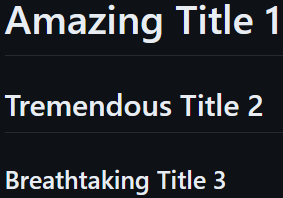

# Exploring-Markdown-Possibilities

Discover here some tips to help you enhance your markdown files.

Let's go !

<br>

## Add titles and subtitles

You can transform a text into a title / subtitle simply by adding `#` before it.

Let's take an example. If you write into your markdown :

` # Amazing Title 1 `

` ## Tremendous Title 2 `

` ### Breathtaking Title 3 `

<br>

Here is what will be displayed :
<br>
<br>

<br>

As you can see, the more `#` you add, the lower your element will be in the title hierarchy.

<br>

## Stylize your text

| Style |   Syntax   |    Example   |    Output   |
|--------------|------------|--------------|-------------|
| Bold | `** **` or `__ __` | `__Bold text__` | **Bold text** |
|    Italic   | `* *` or `_ _` | `*Italic text*` | *Italic text* |
|Strikethrough   | `~~ ~~` | `~~Mistake~~`| ~~Mistake~~ |
|Bold and nested italic | `** **` and `_ _` | `**I have an _urgent_ notice !**`| **I have an _urgent_ notice !** |

<br>

## Add quote

To transform a text into a quote, you can simply add `>' before it.

Example : if you write 

` > "The yes needs the no to win against the no." `

<br>

The following will be displayed :

> "The yes needs the no to win against the no."

> [!NOTE]
> You can see that the quoted text is now indented and has a different color from the standard one.

<br>

## Add code

Want to add some code to your markdown file ? This is possible !

To do so, put triple backticks ``` before and after the text you want to apply the code format on.

Example : if you write

` ```
print("Hello World !")
``` `

<br>

The following will be displayed :
```
print("Hello World !")
```
<br>

## Add a text container

Pretty cool to display `some hilighted text`, isn't it ?

To do so, you just have to put ``` ` ``` before and after the text you want to highlight.

<br>

Example : if you write 

```
`some important text`
```

The following will be displayed :

`some important text`

<br>

## Add a link

You can insert a link into a markdown file by writing :
` [text_of_the_link](url) `

<br>

Example : let's say you want to add a link pointint out to this url :

`https://www.imdb.com/`

inside a text 

`IMDB`

Then you can write :

`Here is a link pointing out to the website of [IMDB](https://www.imdb.com/).`

And see the result :

Here is a link pointing out to the website of [IMDB](https://www.imdb.com/).
