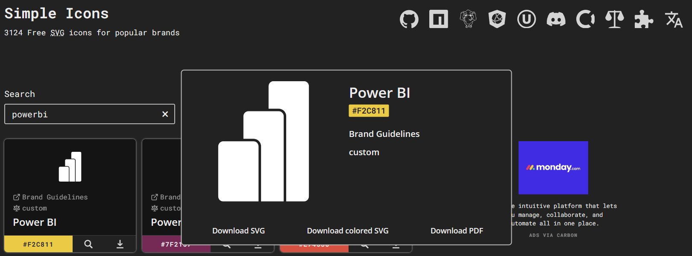

<p align="center">
  <a></a>
</p>

# Exploring-Markdown-Possibilities

<br>

Discover here some tips to help you enhance your markdown files.

Let's go !

<br>

## Add titles and subtitles

You can transform a text into a title / subtitle simply by adding `#` before it.

Let's take an example. If you write into your markdown :

` # Amazing Title 1 `

` ## Tremendous Title 2 `

` ### Breathtaking Title 3 `

<br>

Here is what will be displayed :
<br>
<br>

<br>

As you can see, the more `#` you add, the lower your element will be in the title hierarchy.

<br>

## Stylize your text

| Style |   Syntax   |    Example   |    Output   |
|--------------|------------|--------------|-------------|
| Bold | `** **` or `__ __` | `__Bold text__` | **Bold text** |
|    Italic   | `* *` or `_ _` | `*Italic text*` | *Italic text* |
|Strikethrough   | `~~ ~~` | `~~Mistake~~`| ~~Mistake~~ |
|Bold and nested italic | `** **` and `_ _` | `**I have an _urgent_ notice !**`| **I have an _urgent_ notice !** |

<br>

## Add quote

To transform a text into a quote, you can simply add `>` before it.

Example : if you write 

` > "The yes needs the no to win against the no." `

<br>

The following will be displayed :

> "The yes needs the no to win against the no."

> [!NOTE]
> You can see that the quoted text is now indented and has a different color from the standard one.

<br>

## Add code

Want to add some code to your markdown file ? This is possible !

To do so, put triple backticks ` ``` ` before and after the text you want to apply the code format on.

Example : if you write

` ```
print("Hello World !")
``` `

<br>

The following will be displayed :
```
print("Hello World !")
```
<br>

## Add a text container

Pretty cool to display `some hilighted text`, isn't it ?

To do so, you just have to put ``` ` ``` before and after the text you want to highlight.

<br>

Example : if you write 

```
`some important text`
```

The following will be displayed :

`some important text`

<br>

## Add a link

You can insert a link into a markdown file by writing :

<br>

` [text_of_the_link](url) `

<br>

Example : let's say you want to add a link pointint out to this url :

`https://www.imdb.com/`

inside a text 

`IMDB`

Then you can write :

`Here is a link pointing out to the website of [IMDB](https://www.imdb.com/).`

And see the result :

Here is a link pointing out to the website of [IMDB](https://www.imdb.com/).

> [!TIP]
> If the ressource you want to create a link for is insite the repository, it is recommended to use relative links. That will make it easier for users if they navigate into your repository or clone it.
> <br>
> For example, if I want to add a link leading to a file or a folder that is in my repository :
> <br>
> ` [full_link](https://github.com/user/repository/tree/branch/folder/file) `
> <br>
> <br>
> I can use the relative link instead, and the result will be the same
> <br>
> ` [relative_link](folder/file) `
> <br>
> <br>
> If you want more information about relative links, don't hesitate to have a look at [GitHub documentation about relative links](https://docs.github.com/en/get-started/writing-on-github/getting-started-with-writing-and-formatting-on-github/basic-writing-and-formatting-syntax#relative-links).

<br>

## Add an image

You can also add an image inside a markdown file.

To do so, here is what you can write :

<br>

`  `

<br>

Example :

``

<br>


<br>

You can even use ` html ` code to better the rendering of the image.

For example here, let's say you want a smaller and horizontally-centered image.

Here is an example of code you could write to achieve this :

```
<p align="center">
  <a></a>
</p> 
```
<p align="center">
  <a></a>
</p> 

Here, you apply the changes mentioned above thanks to the `align="center"` and `width="128px"`.

As you can see, you don't have to be a web developer or an HTML expert to insert some code that can bring some huge improvment to your markdown files.

> [!TIP]
> Just like the link section, it is recommended to use relative links over absolute links when it is possible.

<br>

## Add a list

You can add an unordered list :
```
- Elon Musk
* Jeff Bezos
+ Steve Jobs
```
- Elon Musk
- Jeff Bezos
- Steve Jobs

<br>

an ordered list :
```
1. Apple
2. Banana
3. Cherry
```
1. Apple
2. Banana
3. Cherry

<br>

and even a nested list :
```
1. Fist level
   - Second level
     - Third level
```
1. Fist level
   - Second level
     - Third level

<br>

## Add footnotes

It's possible to add footnotes by applying this syntax :

```
Life is short[^1], time is precious[^2].

[^1]: Source that proves life is short
[^2]: Source that proves time is precious
```

<br>

This is how it will render :

<br>

Life is short[^1], time is precious[^2].

Click on the links to see the footnotes at the bottom of this page.

[^1]: Source that proves life is short
[^2]: Source that proves time is precious

<br>

## Add alerts

There are some alert blocks that you can use to point out information in various ways.

Here are the different possibilities :

```
> [!NOTE]
> Useful information

> [!TIP]
> Pieces of advice

> [!IMPORTANT]
> Key information

> [!WARNING]
> Points requiring further attention.

> [!CAUTION]
> Points requiring high vigilance.
```

<br>

This will be displayed the following way :

<br>

> [!NOTE]
> Useful information

> [!TIP]
> Pieces of advice

> [!IMPORTANT]
> Key information

> [!WARNING]
> Points requiring further attention.

> [!CAUTION]
> Points requiring high vigilance.

<br>

## Add a table

Having a table in your repository can really look great, and it's not that complicated to implement one.

To add a table, you can use this syntax :

```
| Column_name_1 | Column_name_2 | Column_name_3 |
|---------------|---------------|---------------|
|    value_1    |    value_2    |    value_3    |
|    value_4    |    value_5    |    value_6    |
|    value_7    |    value_8    |    value_9    |
```

Here, the number of caracters between the `|` signs does not really matter, and neither does the difference of caracters of the cells within your table, you just have to pay attention that you have the same number of columns for each line of the tab you are designing.

<br>

Let's try to make a table to describe a data source :

```
| Column | Description |
|---------------|---------------|
|    show_id    |    Unique ID for every Show    |
|    type    |    A Movie or TV Show    |
|    title    |    Title of the Movie / Tv Show    |
```
| Column | Description |
|---------------|---------------|
|    show_id    |    Unique ID for every Show    |
|    type    |    A Movie or TV Show    |
|    title    |    Title of the Movie / Tv Show    |

<br>

## Add a customized animated message

If you want to go further, you can add a customized animated message.

This is possible thanks to the [Readme Typing SVG website](https://readme-typing-svg.demolab.com/demo/).

<br>

Here, in just a few seconds, you can type the successive text lines that you want to display, and even change settings like the font, the size or the color.

When you have defined all your parameters, at the bottom of the page, you can preview the result. You will also find the markdown link corresponding to the animated message you just designed. All you have to do next, is to copy this link and paste it into your markdown file, and that's it.

<br>

Have a try ! The process is really entertaining, and the result is worth it !

For example, here are the text lines I have chosen for my animated message :


<br>

And here is the result !

[](https://git.io/typing-svg)

## Add a badge

A simple way to add a badge is to insert this kind of code in the github markdown file

```

```

with :

- badge_name : the text that will be displayed in the badge
- badge_color_code : the HEX (6 caracters) code of the wanted color for the badge
- logo_name_from_simpleicons : the slug of the logo from [simpleicons repository](https://github.com/simple-icons/simple-icons/blob/master/slugs.md) . You can preview them on the website [simpleicons.org](https://simpleicons.org/)
- logo_color : the wanted color for the logo

Example : let’s say we want to display in a github markdown a yellow badge, with Power BI logo and with Power BI written in black. 

Let’s query power bi on https://simpleicons.org/, here is the best result :



To have the slug of the corresponding logo, we go to [simple-icons GitHub repository](https://github.com/simple-icons/simple-icons/blob/master/slugs.md). We look for power bi and this is what we find :


So the slug is `powerbi`

Therefore we will enter the following parameters :

- badge_name : `Power%20BI` (“Power BI” can be displayed if we replace space with %20)
- badge_color_code : `F2C811`, as indicated in the screenshot to respect the brand color
- logo_name_from_simpleicons : `powerbi`
- logo_color : the wanted color for the logo

Then we will enter this following line on our github markdown file :

```markdown

```

And this is what it looks like at the end in the github markdown file :


<br>

## Try yourself, keep learning and take inspiration from other people

This is maybe the best piece of advice I could give you : data is a fast-paced environment, and things change very quickly. You can keep learning things everyday, and this way you will constantly discover new improvments for your markdown files. Don't hesitate to look at what other users made on theirs : when you find one where you like the rendering of a specific element, you can have a look at the code to see how it was implemented.

The aim is not necessarily to multiply formatting so as to achieve a busy, unreadable result, but to create markdown files in formats that are pleasing to the eye and that suit you. 

Try out some options, look at various markdown files, and design the ones that suit you best. 

<br>

## Conclusion

I hope you've found this guide useful, and that it's provided you with tips you can use again and again.

It does not aim to be exhaustive. It's just a starting point to make you break through the markdown possibilities.

Now that you have discovered basic knowledge about them, you can explore by yourself all the possibilities of the markdownverse. The sky's the limit.

Now you have no excuse for making ugly, unreadable markdown files !
